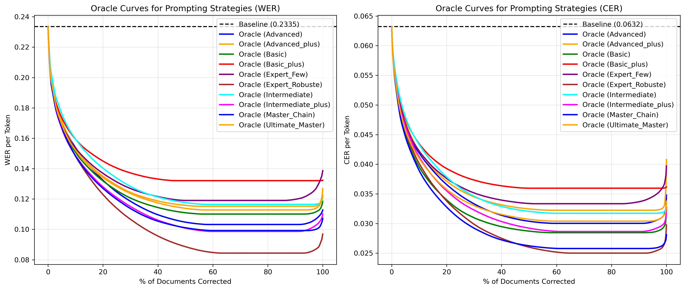
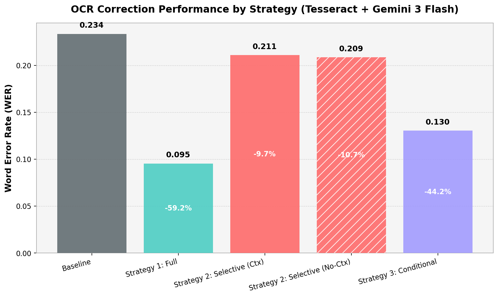

# Document Engineering OCR Benchmarking Experiment

This repository contains the research, experiments, and LaTeX documentation for benchmarking document layout parsing and evaluating the cost vs. correctness trade-offs of using Large Language Models (LLMs) for Optical Character Recognition (OCR) ground truth correction.

## 📌 Project Overview

The primary focus of this project is to assess document layout parser models and implement an effective pipeline for threshold-based LLM OCR correction. The core research addresses:

1.  **Model Evaluation:** Benchmarking state-of-the-art parser models alongside standard OCR engines (Tesseract, EasyOCR, PaddleOCR).
2.  **Ground Truth Generation & Correction:** Utilizing LLMs with tailored, increasingly complex prompts (from basic cleanup to expert "expert-robuste" strategies).
3.  **Correctness vs. Cost Trade-offs:** selective triggering of LLM corrections based on OCR confidence scores.
    *   **Full Correction:** Processes the entire document via LLM.
    *   **Selective Correction:** Targets only low-confidence segments (e.g., < 80% or 90%) with local context.
    *   **Conditional Full Correction:** Processes entire documents only if the average confidence falls below a set threshold.
4.  **Metrics & Visualization:** Implementing robust evaluation metrics including WER (Word Error Rate) and CER (Character Error Rate).

---

## 📂 Directory Structure

```text
.
├── code/                   # Execution scripts and analysis tools
│   ├── run_evaluations.py          # Main evaluation pipeline entry point
│   ├── run_evaluations_conditional.py # Hybrid strategy evaluation
│   ├── update_confidence_data.py   # Stats generation for conditional logic
│   ├── plot_confidence.py          # Visualizing OCR confidence distributions
│   ├── plot_error_confidence.py    # Word-level error/confidence analysis
│   └── plot_error_confidence_cer.py # Character-level error/confidence analysis
├── data/                   # Datasets and operational configurations
│   ├── evaluation_dataset/         # Images and groundtruth.json
│   ├── raw_ocr_results.json        # Cached raw OCR outputs (Efficiency)
│   └── sample_prompts.json         # Hierarchical LLM prompt library
├── paper/                  # LaTeX manuscript for ICDAR/DocEng 2026
│   ├── main.tex                    # Manuscript source
│   ├── main.bib                    # Bibliography/Related Papers
│   └── figures/                    # Experimental plots and visualizations
├── results/                # Processed metrics and leaderboard data
│   ├── summary.json                # Aggregated run metrics
│   └── leaderboard.json            # Ranked strategy performance
└── related papers/         # Foundational literature and PDF repository
```

---

## 🚀 Getting Started

### 1. Environment Setup
Ensure your Python environment is initialized and all dependencies are installed within a virtual environment.

```bash
# Initialize venv
python3 -m venv venv
source venv/bin/activate

# Install requirements
pip install -r requirements.txt
```

### 2. Configuration
Create a `.env` file in the root directory and provide your OpenRouter API key:
```text
OPENROUTER_API_KEY=your_key_here
```

---

## 🛠 Core Commands

### Evaluation Pipelines
| Command | Description |
| :--- | :--- |
| `python code/run_evaluations.py` | Runs the standard batch evaluation for Selective and Full correction. |
| `python code/update_confidence_data.py` | Processes OCR cache to generate image-level stats (Required for Strategy C). |
| `python code/run_evaluations_conditional.py` | Executes the Conditional Full Correction experiment. |

### Visualization & Metrics
Generate the charts used in the Methodology and Results sections:
```bash
python code/plot_confidence.py           # Confidence density plots
python code/plot_error_confidence.py     # WER vs Confidence alignment
python code/plot_error_confidence_cer.py # CER vs Confidence (Historical artifacts)
```

### Paper Compilation
To compile the LaTeX manuscript:
```bash
cd paper
pdflatex main.tex
bibtex main
pdflatex main.tex
pdflatex main.tex
```

---

## 📊 Experimental Results (Current Baseline)

| Strategy | WER | CER | Improvement (WER) | Estimated Cost |
| :--- | :--- | :--- | :--- | :--- |
| **Baseline (No LLM)** | 0.5439 | 0.1824 | - | $0.00 |
| **Full Text Correction** | 0.1176 | 0.0345 | **+78.4%** | $0.00* |
| **Conditional Full (0.90)** | 0.1241 | 0.0447 | **+77.2%** | **$0.008** |
| **Selective Ortho (0.80)** | 0.2628 | 0.0809 | **+51.7%** | $0.00 |

### The "Modernization" Trap & Historical Context
While traditional orthographic correctors (e.g., `pyspellchecker`) provide some improvement on very noisy OCR (bringing WER from **0.54** down to **0.32**), they plateau quickly as they start incorrectly normalizing valid 18th-century vocabulary (*seroit*) into modern French. LLM-based approaches, like `gemini-3-flash-preview` with expert prompts, succeed by leveraging context-aware semantics to preserve historical authenticity while fixing actual OCR artifacts, reaching much lower error rates (**WER 0.11**).

---

## 🔬 Additional Experimental Results (Not in Paper)

Due to length constraints in the 4-page CIKM Short Paper manuscript, several detailed analyses and ablations were omitted. We present them in full below:

### 1. Prompt Design & Ablation Study
We evaluated 10 hierarchical prompt templates ranging from basic cleanup to expert-engineered and Chain-of-Thought (CoT) instructions. Below is the performance of the full correction strategy under each template using **Gemini 3 Flash** as the downstream corrector across all three OCR engines (**Tesseract**, **EasyOCR**, and **PaddleOCR**).

| Prompt Level | Strategy Key | Tesseract (WER/CER) | EasyOCR (WER/CER) | PaddleOCR (WER/CER) |
|---|---|---|---|---|
| **Baseline (No LLM)** | - | 0.2335/0.0632 | 0.5992/0.1511 | 0.1673/0.0420 |
| Basic (1) | `Full_Basic` | 0.1185/0.0324 | 0.4725/0.1051 | 0.1150/0.0306 |
| Basic+ (2) | `Full_Basic_plus` | 0.1409/0.0374 | 0.4470/0.0946 | 0.1398/0.0376 |
| Intermediate (3) | `Full_Intermediate` | 0.1192/0.0328 | 0.1458/0.0397 | 0.0902/0.0277 |
| Intermediate+ (4) | `Full_Intermediate_plus` | 0.1131/0.0327 | 0.1622/0.0436 | 0.0971/0.0316 |
| Advanced (5) | `Full_Advanced` | 0.1135/0.0364 | 0.2915/0.1806 | 0.0888/0.0334 |
| Advanced+ (6) | `Full_Advanced_plus` | 0.1309/0.0418 | 0.1999/0.0565 | 0.0997/0.0323 |
| Expert Few-Shot (7) | `Full_Expert_Few_Shot` | 0.1381/0.0397 | 0.1890/0.0514 | 0.1306/0.0391 |
| Expert Robuste (8) | `Full_Expert_Robuste` | **0.0953**/0.0292 | **0.1180**/0.0388 | **0.0774**/0.0268 |
| Master CoT (9) | `Full_Master_Chain_of_Thought` | 0.1065/**0.0278** | 0.1642/0.0466 | 0.0858/**0.0265** |
| Ultimate Master (10) | `Full_Ultimate_Master` | 0.1238/0.0356 | 0.1618/0.0489 | 0.0987/0.0316 |

#### Key Insights from Prompt Ablation:
- **Expert Robuste (8)** achieves the absolute lowest Word Error Rate (WER) across all three engines. Its brute-force instruction template avoids conversational padding/formatting and forces the LLM to output pure corrected text directly.
- **Master Chain of Thought (CoT) (9)** achieves the lowest Character Error Rate (CER) on Tesseract and PaddleOCR. The structured introspection step (`<plan_et_analyse>`) lets the model capture fine-grained character details before producing the final text.
- A "Modernization Trap" is visible at levels 2, 6, and 7 where prompts over-optimize for modern styling, resulting in a higher WER on historically spelling-rich documents.

### 2. Oracle Curves for Prompting Strategies
Below is the graph comparing the Oracle curves for all prompting strategies, indicating how error rate declines as we correct an increasing percentage of documents.



### 3. Downstream Correction LLM Model Comparison
We evaluated six open- and closed-source LLMs using the `Full_Expert_Robuste_8` prompt template on Tesseract OCR:

| Model | Average WER | Average CER | Key Takeaway |
|---|---|---|---|
| **Google Gemini 3 Flash** | **0.0969** | **0.0298** | Absolute best correction quality with high speed and low cost. |
| **Google Gemini 3.1 Flash Lite** | 0.1093 | 0.0403 | Exceptional speed and cost efficiency, perfect for large scale runs. |
| **OpenAI GPT-4o** | 0.1282 | 0.0486 | Solid correction, but significantly more expensive without quality gains. |
| **OpenAI GPT-4o Mini** | 0.1646 | 0.0631 | Performs worse than baseline on character-level metrics (0.0631 vs 0.0632). |
| **Qwen 2.5 72B Instruct** | 0.1742 | 0.0861 | Struggles with historical French typography. |
| **Meta Llama 3.3 70B Instruct** | 0.1924 | 0.0981 | Tends to over-modernize or hallucinate text structure. |
| **Mistral Small 3.1 24B Instruct** | 5.8122 | 5.7844 | Fails completely due to output format formatting errors/hallucinations. |
| *Baseline Tesseract (No LLM)* | *0.2335* | *0.0632* | Reference baseline. |

### 4. GBT Router Feature Importances
When training our Gradient Boosted Trees (GBT) classifier to route documents (predicting if correction improves WER by $>3\%$), the following features are the most critical:

| Rank | Feature | Importance | Type | Description |
|---|---|---|---|---|
| 1 | `ortho_integrity_char` | 0.0756 | Surface | Character-level similarity to standard spellcheck suggestions |
| 2 | `ortho_integrity_word` | 0.0721 | Surface | Fraction of spellcheck-unchanged words (in-vocabulary dictionary rate) |
| 3 | `avg_confidence` | 0.0684 | Metadata | Per-document average of OCR token confidence scores |
| 4 | `avg_chars_per_line` | 0.0429 | Layout | Layout complexity / width indicator |
| 5 | `publication_year` | 0.0404 | Metadata | Historical age (printing quality correlation) |
| 6 | `word_count` | 0.0372 | Surface | Document size |
| 7 | `freq_l` | 0.0360 | Surface | Frequency of character 'l' (common confusions like l vs 1) |
| 8 | `space_ratio` | 0.0342 | Surface | Density of whitespaces |
| 9 | `spell_length_ratio` | 0.0319 | Surface | Length ratio of spellcheck suggestions vs raw text |
| 10 | `text_length` | 0.0274 | Surface | Total character count |

### 5. Routing Strategy Performance Comparison Chart
Below is the visualization comparing our three main routing strategies against the baseline and full correction.



---
*This project is part of the research for CIKM 2026.*
