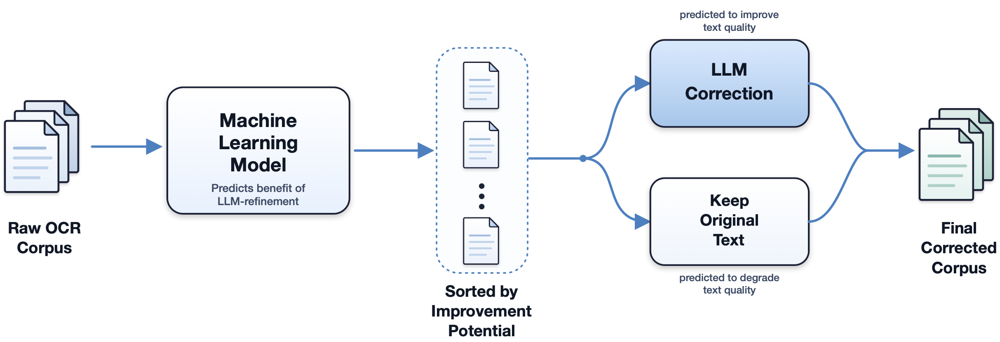
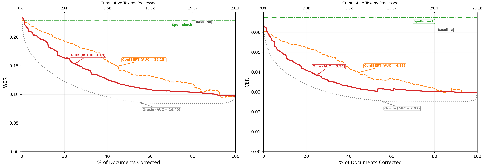
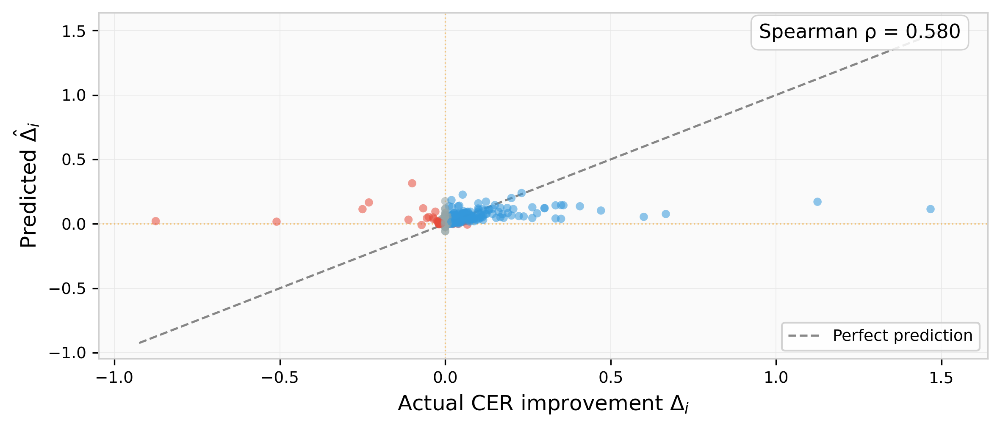

# Knowing When to Correct: Cost-Aware LLM Routing for OCR Post-Correction in Historical Documents

This repository contains the research, experiments, and LaTeX documentation for Cost-Aware LLM Routing for OCR Post-Correction in Historical Documents.

## 📌 Project Overview

The primary focus of this project is to implement a cost-aware selective routing framework for LLM-based OCR post-correction. We evaluate this strategy across multiple OCR engines and correction models using historical documents.



The core research addresses:
1. **Model Evaluation:** Benchmarking parser models and OCR engines (Tesseract, EasyOCR, PaddleOCR).
2. **Ground Truth Generation & Correction:** Using LLMs with expert-engineered prompt strategies.
3. **Correctness vs. Cost Trade-offs:** selective triggering of LLM corrections based on OCR confidence scores.
    * **Full Correction:** Processes the entire document via LLM.
    * **Selective Correction:** Targets only low-confidence segments with local context.
    * **Conditional Full Correction:** Processes entire documents only if average confidence falls below a threshold.
4. **Metrics & Visualization:** Implementing robust metrics including WER (Word Error Rate) and CER (Character Error Rate).

---

## 📂 Directory Structure

```text
.
├── code/                   # Execution scripts and analysis tools
│   ├── run_evaluations.py          # Main evaluation pipeline entry point
│   ├── run_evaluations_conditional.py # Hybrid strategy evaluation
│   ├── update_confidence_data.py   # Stats generation for conditional logic
│   ├── plotting/                   # Visualization scripts for paper figures
│   │   ├── plot_delta_scatter_spearman.py # Figure 3 generator
│   │   ├── plot_routing_frontier_lassocv_clean.py # Figure 2 generator
│   │   └── ...
│   └── ...
├── data/                   # Datasets and operational configurations
│   ├── evaluation_dataset/         # Images and groundtruth.json
│   ├── raw_ocr_results.json        # Cached raw OCR outputs (Efficiency)
│   └── sample_prompts.json         # Hierarchical LLM prompt library
├── paper/                  # LaTeX manuscript for CIKM 2026 (Short Paper)
│   ├── main.tex                    # Manuscript source
│   ├── main.bib                    # Bibliography/Related Papers
│   └── figures/                    # Experimental plots and visualizations
├── results/                # Processed metrics and leaderboard data
│   ├── summary.json                # Aggregated run metrics
│   └── leaderboard.json            # Ranked strategy performance
└── related papers/         # Foundational literature and PDF repository
```

---

## 🚀 Getting Started

### 1. Environment Setup
Ensure your Python environment is initialized and all dependencies are installed.

```bash
# Initialize venv
python3 -m venv venv
source venv/bin/activate

# Install requirements
pip install -r requirements.txt
```

### 2. Configuration
Create a `.env` file in the root directory and provide your OpenRouter API key:
```text
OPENROUTER_API_KEY=your_key_here
```

---

## 🛠 Core Commands

### Evaluation Pipelines
| Command | Description |
| :--- | :--- |
| `python code/run_evaluations.py` | Runs the standard batch evaluation for Selective and Full correction. |
| `python code/update_confidence_data.py` | Processes OCR cache to generate image-level stats (Required for Strategy C). |
| `python code/run_evaluations_conditional.py` | Executes the Conditional Full Correction experiment. |

### Visualization & Metrics
Generate the charts used in the Methodology and Results sections:
```bash
python code/plotting/plot_delta_scatter_spearman.py        # Predicted vs Actual scatter plot (Figure 3)
python code/plotting/plot_routing_frontier_lassocv_clean.py # Routing Frontier (Figure 2)
```

---

## 📊 Dataset & Corpus Composition (Table 1 from Paper)

Our evaluation corpus consists of 609 text segments from nine Swiss historical newspapers (1733–1945) in the digital archives of the Canton of Vaud.

| Newspaper | Dates | Issues | Pages | Text segments |
| :--- | :---: | :---: | :---: | :---: |
| La Revue | 1875–1945 | 4 | 5 | 139 |
| Feuille d'Avis | 1762–1841 | 4 | 13 | 131 |
| Tribune de Lausanne | 1912 | 3 | 4 | 105 |
| Nouvelliste Vaudois | 1822–1840 | 3 | 7 | 90 |
| Petite Revue | 1943 | 1 | 1 | 46 |
| Lausanne Artistique | 1926 | 1 | 1 | 32 |
| Almanach | 1832 | 1 | 8 | 31 |
| Estafette | 1862 | 1 | 1 | 19 |
| Mercure Suisse | 1733–1738 | 2 | 5 | 16 |
| **Total** | **1733–1945** | **20** | **45** | **609** |

---

## 📊 Experimental Results (Table 2 from Paper)

The table below reports the routing comparison on Tesseract OCR with Gemini 3 Flash correction. CER and WER report the corpus-level error rate after applying each method.

| Method | CER | WER | Docs Corrected | Token Savings | CER Improv. |
| :--- | :---: | :---: | :---: | :---: | :---: |
| Baseline OCR (no correction) | 0.0632 | 0.2335 | 0/597 | 100% | — |
| Spell-check | 0.0675 | 0.2284 | N/A | N/A | -6.80% |
| ConfBERT ($p \geq 0.5$) | 0.0360 | 0.1330 | 349/597 | 17.6% | +43.0% |
| ConfBERT (Top 40% budget) | 0.0422 | 0.1589 | 239/597 | 39.6% | +33.2% |
| ConfBERT (Top 60% budget) | 0.0367 | 0.1332 | 358/597 | 15.6% | +41.9% |
| ConfBERT (Top 80% budget) | 0.0318 | 0.1180 | 478/597 | 2.5% | +49.7% |
| **Our Approach** ($\hat{\Delta} \geq 0.03$) | **0.0326** | **0.1198** | 240/597 | **64.9%** | +48.4% |
| Conditional (Top 40% budget) | 0.0327 | 0.1198 | 239/597 | 65.2% | +48.4% |
| Conditional (Top 60% budget) | 0.0308 | 0.1069 | 358/597 | 41.0% | +51.2% |
| Conditional (Top 80% budget) | 0.0303 | 0.1000 | 478/597 | 11.8% | +52.1% |
| Full LLM (all segments) | 0.0298 | 0.0969 | 597/597 | 0% | +52.9% |

### The "Modernization" Trap & Historical Context
While traditional orthographic correctors (e.g., `pyspellchecker`) provide only minor improvement on historical OCR (bringing WER from 23.35% down to 22.84% on Tesseract, and actually worsening CER from 6.32% to 6.75%), they plateau quickly and introduce errors by incorrectly normalizing valid 18th-century vocabulary (like changing historical "seroit" to modern "serait"). LLM-based approaches with expert prompts succeed by leveraging context-aware semantics to preserve historical authenticity while fixing actual OCR artifacts, reaching much lower error rates (WER 9.69% for Full LLM and 11.98% for our regression-guided router).

### Routing Frontier Chart (Figure 2 from Paper)
Below is the routing frontier comparing the four OCR-correction strategies. The secondary x-axis (top) reports cumulative tokens submitted to the LLM (Gemini 3 Flash).



---

## 🔬 Additional Experimental Results (Not in Paper)

Due to length constraints in the 4-page CIKM Short Paper manuscript, several detailed analyses and ablations were omitted. We present them in full below:

### 1. Prompt Design & Ablation Study
We evaluated 10 hierarchical prompt templates ranging from basic cleanup to expert-engineered and Chain-of-Thought (CoT) instructions. Below is the performance of the full correction strategy under each template using **Gemini 3 Flash** as the downstream corrector across all three OCR engines (**Tesseract**, **EasyOCR**, and **PaddleOCR**).

| Prompt Level | Strategy Key | Tesseract (WER/CER) | EasyOCR (WER/CER) | PaddleOCR (WER/CER) |
|---|---|---|---|---|
| **Baseline (No LLM)** | - | 0.2335/0.0632 | 0.5992/0.1511 | 0.1673/0.0420 |
| **Prompt A** | `Full_Basic` | 0.1185/0.0324 | 0.4725/0.1051 | 0.1150/0.0306 |
| **Prompt B** | `Full_Basic_plus` | 0.1409/0.0374 | 0.4470/0.0946 | 0.1398/0.0376 |
| **Prompt C** | `Full_Intermediate` | 0.1192/0.0328 | 0.1458/0.0397 | 0.0902/0.0277 |
| **Prompt D** | `Full_Intermediate_plus` | 0.1131/0.0327 | 0.1622/0.0436 | 0.0971/0.0316 |
| **Prompt E** | `Full_Advanced` | 0.1135/0.0364 | 0.2915/0.1806 | 0.0888/0.0334 |
| **Prompt F** | `Full_Advanced_plus` | 0.1309/0.0418 | 0.1999/0.0565 | 0.0997/0.0323 |
| **Prompt G** | `Full_Expert_Few_Shot` | 0.1381/0.0397 | 0.1890/0.0514 | 0.1306/0.0391 |
| **Prompt H** | `Full_Expert_Robuste` | **0.0953**/0.0292 | **0.1180**/0.0388 | **0.0774**/0.0268 |
| **Prompt I** | `Full_Master_Chain_of_Thought` | 0.1065/**0.0278** | 0.1642/0.0466 | 0.0858/**0.0265** |
| **Prompt J** | `Full_Ultimate_Master` | 0.1238/0.0356 | 0.1618/0.0489 | 0.0987/0.0316 |

#### Prompt Level Groupings & Definitions
* **Group 1: Prompts A-C (Basic Formatting & Historical Rules)**
  * **Prompt A (Correction Minimale)**: Direct instructions setting the global task context without listing specific rules.
  * **Prompt B (Spacing and Layout)**: Adds instructions on whitespace reduction and leaving historical vocabulary untouched.
  * **Prompt C (History & Punctuation)**: Adds explicit rules for punctuation spacing and transcribing historical long "S" (`ſ` $\rightarrow$ `s`).
* **Group 2: Prompts D-G (OCR Sensitivity & Intermediate Regularization)**
  * **Prompt D (OCR Error Sensitivity)**: Injects hints on typical OCR-specific confusions (e.g., mapping `u` $\leftrightarrow$ `n`, `9` $\leftrightarrow$ `g`).
  * **Prompt E (Ligatures & Ratures)**: Introduces cleaning rules for historical ligatures, accents, and strike-through text.
  * **Prompt F (Bulleted Role Structure)**: Reformulates all previous instructions into clean, bulleted categories.
  * **Prompt G (Contextual Examples)**: Integrates in-context few-shot learning by providing examples of raw OCR inputs and target corrections.
* **Group 3: Prompts H-J (Advanced & Structural Expert Guidelines)**
  * **Prompt H (Brute-Force Extraction)**: Employs a zero-preamble, direct extraction command that forces the LLM to output the corrected text directly.
  * **Prompt I (Chain-of-Thought)**: Instructs the model to write a detailed analysis inside a `<plan_et_analyse>` block before outputting the corrected text.
  * **Prompt J (Exhaustive Manual)**: A comprehensive instruction set merging all previous guidelines into a highly formal manual format.

### 2. Contextual Routing Performance (Selective vs. No-Context)

To correct low-confidence text segments, we compare two routing strategies that differ in how much text is sent to the LLM:
- **Selective (with Context)**: The target line is sent along with its preceding and succeeding layout lines.
- **Selective No-Context (No-Ctx)**: The routed line is sent in isolation.

Below is the performance comparison across all 10 prompt levels for Tesseract OCR at confidence thresholds of $\text{thr} = 80$ and $\text{thr} = 90$:

| Prompt Level | Full (WER/CER) | Selective thr80 (Ctx) | Selective thr80 (No-Ctx) | Selective thr90 (Ctx) | Selective thr90 (No-Ctx) | Ours (Δ >= 0.03) | Ours Routed % |
|---|---|---|---|---|---|---|---|
| **Prompt A** | 0.1185/0.0324 | 0.1974/0.0644 | 0.2485/0.1375 | 0.2396/0.1021 | 0.2216/0.1124 | 0.1346/0.0362 | 40.4% |
| **Prompt B** | 0.1409/0.0374 | 0.1898/0.0657 | 0.2045/0.0670 | 0.2233/0.0962 | 0.2143/0.0943 | 0.1533/0.0407 | 32.8% |
| **Prompt C** | 0.1192/0.0328 | 0.1822/0.0594 | 0.1879/0.0641 | 0.1945/0.0895 | 0.1959/0.0902 | 0.1480/0.0389 | 35.0% |
| **Prompt D** | 0.1131/0.0327 | 0.1959/0.0668 | 0.1969/0.0658 | 0.2024/0.0911 | 0.1955/0.0904 | 0.1320/0.0365 | 39.0% |
| **Prompt E** | 0.1135/0.0364 | 0.1841/0.0647 | 0.2514/0.1381 | 0.1916/0.0863 | 0.1968/0.0870 | 0.1367/0.0391 | 32.8% |
| **Prompt F** | 0.1309/0.0418 | 0.1870/0.0645 | 0.2488/0.1355 | 0.1945/0.0884 | 0.1932/0.0866 | 0.1454/0.0397 | 29.0% |
| **Prompt G** | 0.1381/0.0397 | 0.1944/0.0651 | 0.2162/0.0662 | 0.2234/0.0806 | 0.2252/0.0818 | 0.1471/0.0398 | 32.5% |
| **Prompt H** | 0.0953/0.0292 | 0.2108/0.0652 | 0.2086/0.0637 | 0.2161/0.0785 | 0.2149/0.0777 | 0.1198/0.0326 | 40.2% |
| **Prompt I** | 0.1065/0.0278 | 0.2123/0.0663 | 0.2086/0.0636 | 0.2325/0.0805 | 0.2303/0.0891 | 0.1234/0.0319 | 41.4% |
| **Prompt J** | 0.1238/0.0356 | 0.2127/0.0675 | 0.2152/0.0657 | 0.2183/0.0780 | 0.2142/0.0770 | 0.1366/0.0357 | 38.2% |

### 3. Predicted vs. Actual CER Improvement (Figure 3 from Paper)
Below is the correlation scatter plot of the predicted versus actual CER improvement ($\Delta_i$) on held-out segments (Leave-One-Out CV).



### 4. Downstream Correction LLM Model Comparison (Table 3 from Paper)
LLM cost comparison on Tesseract OCR. Full correction ("Cost (full)") vs. our routing ("Cost (routed)"). Open-source models have $0 API cost.

| LLM Model | CER (full) | WER (full) | CER (routed) | WER (routed) | Cost (Full) | Cost (routed) |
| :--- | :---: | :---: | :---: | :---: | :---: | :---: |
| **Gemini 3 Flash** | 0.029 | 0.097 | 0.033 | 0.120 | \$0.182 | \$0.064 |
| **Gemini 3.1 Flash Lite** | 0.040 | 0.109 | 0.048 | 0.154 | \$0.087 | \$0.031 |
| **GPT-4o** | 0.049 | 0.128 | 0.046 | 0.154 | \$0.738 | \$0.259 |
| **Gemma 4 31B** | 0.039 | 0.123 | 0.043 | 0.150 | \$0 | \$0 |
| **Qwen 2.5-72B** | 0.058 | 0.208 | 0.060 | 0.169 | \$0 | \$0 |
| *No correction* | 0.063 | 0.234 | 0.063 | 0.234 | — | — |

### 5. Model Understanding & Feature Salience
To understand how different routing models prioritize features, we extract the top 10 coefficients for the Lasso Regression model.

#### Lasso Regression
*Predicts raw Word Error Rate (WER)*

| Rank | Feature | Coefficient | Type | Description |
|---|---|---|---|---|
| 1 | `newline_density` | +0.1638 | Surface | Higher line density suggests layout noise |
| 2 | `space_ratio` | +0.1447 | Surface | Higher space ratio indicates layout formatting issues |
| 3 | `avg_confidence` | -0.1289 | Metadata | Lower confidence strongly correlates with higher error |
| 4 | `ortho_integrity_word` | -0.0750 | Surface | Word-level dictionary errors |
| 5 | `freq_y` | +0.0689 | Surface | Frequency of letter 'y' |
| 6 | `freq_j` | -0.0332 | Surface | Frequency of letter 'j' |
| 7 | `freq_g` | +0.0329 | Surface | Frequency of letter 'g' |
| 8 | `newspaper_TL` | +0.0285 | Metadata | Target newspaper indicator |
| 9 | `freq_c` | -0.0274 | Surface | Frequency of letter 'c' |
| 10 | `freq_l` | -0.0273 | Surface | Frequency of letter 'l' |

---

## 🛠 Core Feature Set (54 Features & Definitions)

Our selective routing framework uses a 54-dimensional feature set extracted exclusively from the raw OCR text and document metadata (requiring no ground truth). The features are categorized into two groups:

### 1. Text-Surface Features (41 Features)
These features analyze the character-level and word-level properties of the raw OCR text, as well as spelling integrity signals derived from a dictionary.

| Feature Name | Type | Dimension | Description |
| :--- | :---: | :---: | :--- |
| `text_length` | Numeric | 1 | Total number of characters in the raw OCR text. |
| `word_count` | Numeric | 1 | Total number of whitespace-separated words in the raw OCR text. |
| `avg_word_length` | Numeric | 1 | Average character length of the words. |
| `unique_char_ratio` | Ratio | 1 | Ratio of unique characters to total characters (`#unique_chars / #total_chars`). |
| `digit_ratio` | Ratio | 1 | Fraction of characters in the text that are digits. |
| `punct_ratio` | Ratio | 1 | Fraction of characters in the text that are punctuation. |
| `upper_ratio` | Ratio | 1 | Fraction of alphabetic characters that are uppercase. |
| `newline_density` | Ratio | 1 | Fraction of characters that are newlines (`#newlines / #total_chars`). |
| `space_ratio` | Ratio | 1 | Fraction of characters that are spaces (`#spaces / #total_chars`). |
| `freq_a` to `freq_z` | Ratio | 26 | Occurrences of each letter from `a` to `z` divided by total alphabetic characters. |
| `max_run_length` | Numeric | 1 | Maximum length of consecutive identical character runs in the raw OCR. |
| `avg_run_length` | Numeric | 1 | Average length of consecutive identical character runs. |
| `spell_length_ratio` | Ratio | 1 | Ratio of raw OCR character length to spell-corrected OCR character length (`len(ocr) / len(spell_corrected_ocr)`). |
| `ortho_integrity_word`| Ratio | 1 | Fraction of words left unchanged by the French spell-checker (`1.0 - #changed_words / #total_words`). |
| `ortho_integrity_char`| Ratio | 1 | Character-level edit similarity (SequenceMatcher ratio) between raw and spell-corrected text. |
| `dict_hit_rate` | Ratio | 1 | Fraction of alphabetic words successfully found in the spell-checker's French dictionary. |

### 2. Metadata Features (13 Features)
These features capture layout-density proxies, temporal parameters, and the engine's internal character certainty.

| Feature Name | Type | Dimension | Description |
| :--- | :---: | :---: | :--- |
| `num_lines` | Numeric | 1 | Total number of newline-separated lines in the raw OCR. |
| `avg_chars_per_line` | Numeric | 1 | Layout character density proxy (`total_chars / num_lines`). |
| `publication_year` | Numeric | 1 | The year of publication extracted from the document date metadata. |
| `newspaper_*` | One-Hot | 9 | One-hot encoding of the 9 Swiss historical newspapers in the corpus (ACI, Feuille d'Avis de Lausanne, LP, ME, Nouvelliste Vaudois, RL, RLP, TL, esta). |
| `avg_confidence` | Numeric | 1 | Per-document average OCR confidence score (mean of per-token confidence scores). Defaults to 1.0 when confidence data is unavailable. |

---
*This project is part of the research for CIKM 2026.*
